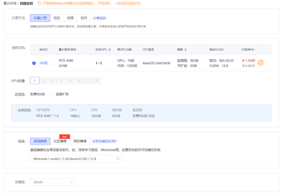
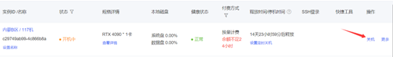
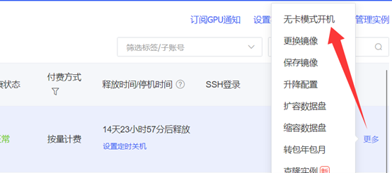
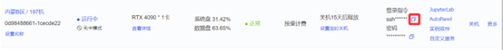

# AutoDL 注册指南

## 1. 进入AutoDL官网并注册账号

`AutoDL` 官网地址：[https://www.autodl.com/home](https://www.autodl.com/home)

账号注册过程略，不作赘述。

## 2. 选取配置

从顶部栏进入 `算力市场`，参考以下配置创建实例，点击 `创建并开机`

> GPU 选择 RTX 4090，镜像选择 Miniconda/conda3/3.10(ubuntu22.04)/11.8

## 3. 使用无卡模式

实例创建完成后会弹出控制台面板。先关机，随后点击 `更多`，选 `无卡模式开机`

> 无卡模式下维持服务器运行的价格会低很多，在此模式下可进行文件上传等操作。在正式开始训练前都只需要无卡模式，等环境部署好后，可以开始训练模型时才需要正式开机。

## 4. 配置密钥登录

在控制台面板点击 `设置密钥登录`，按照指示将你的 ssh 客户端的公钥添加进去，然后复制其登录指令，尝试 ssh 连接，连接成功后即可在 ssh 中进行后续操作。

> 当然你也可以不添加 ssh 公钥，只用用户名 + 密码登录，就是用起来麻烦点。
> 现代 Windows 似乎都自带了 ssh 客户端，如果没有的话建议使用 WSL2。当然如果你直接以 Linux 为主力系统那就没什么好说的了。
