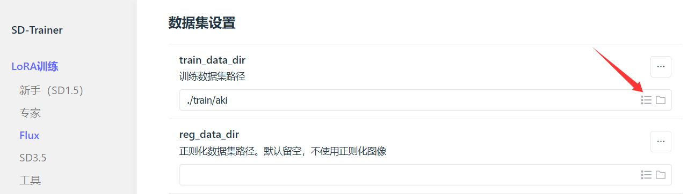
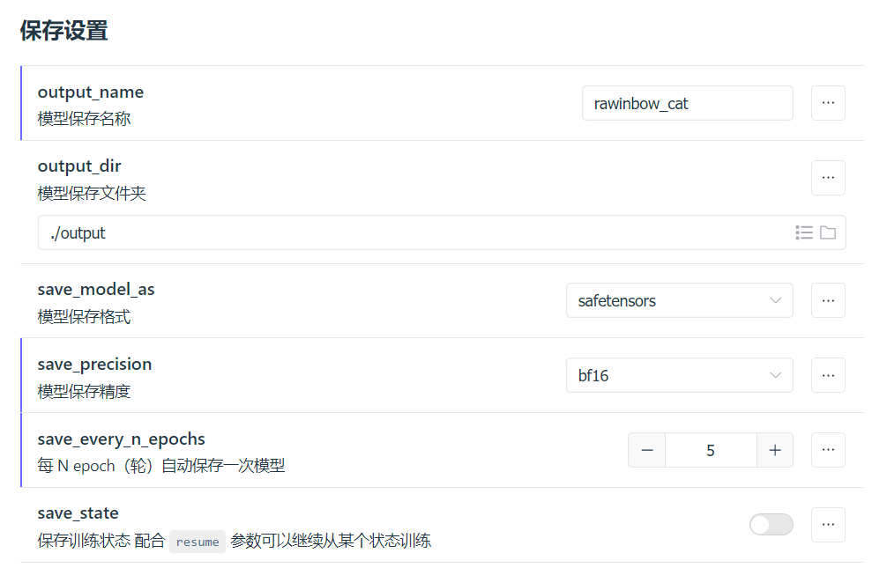
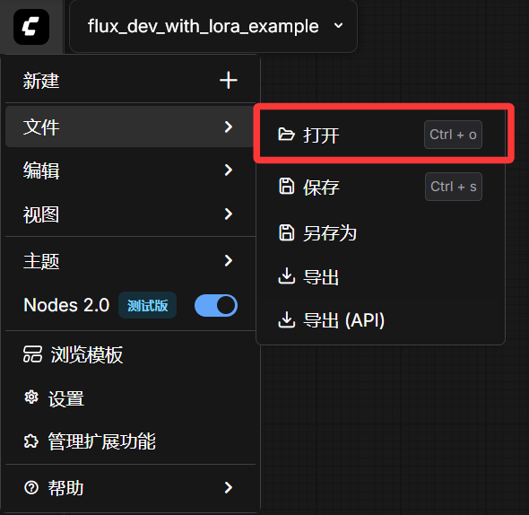
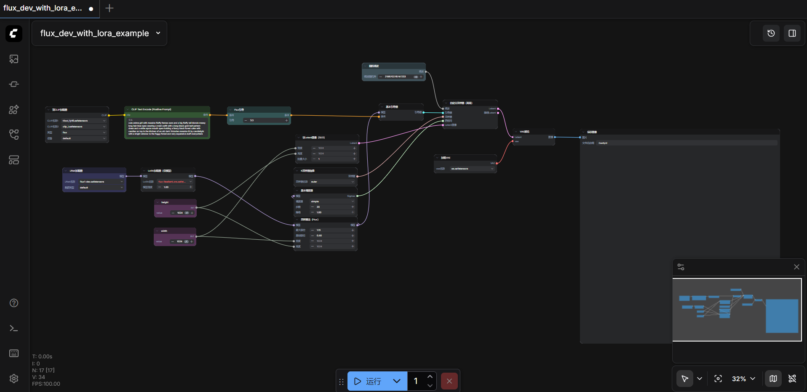
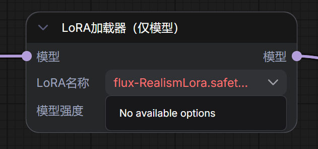
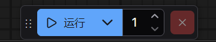
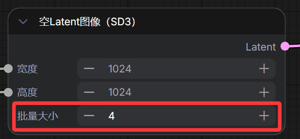

# SD-Trainer + ComfyUI 训练与验证指南

## 1. SD-Trainer 训练指南

### 1.1. 准备训练集

准备形如下的训练集，用于进行对 `FLUX.1` 模型的微调训练

```txt
img_1.jpg
img_1.txt
img_2.jpg
img_2.txt
img_3.jpg
img_3.txt
...
```

其中 `*.jpg` 为图像文件本身，`*.txt` 为对图像文件的描述，可以是自然语言描述，也可以是分词化描述。

如果使用分词化描述，推荐使用如下形式的描述：

> XXX, desc...

其中 `XXX` 为一个独特名称，作为图像生成时的触发词。触发词不应与常见事物重名，例如 Cat 是一个糟糕的触发词，而 RAINBOW_CAT 就是一个较好的触发词。desc...为对图像的分词化描述，这些描述包含了图像的细节。需要注意，分词化描述应当有效描述图像细节，并且遵循“重要内容放在最前”的原则。

一个 `*.jpg` 与 `*.txt` 视一个训练数据，通常需要准备 `20` ~ `30` 条训练数据才能有较好的训练效果。

### 1.2. 规范训练集目录

将准备好的训练集按以下目录结构放置

```txt
rainbowcat/
    20_rainbowcat/
        img_1.jpg
        img_1.txt
        img_2.jpg
        img_2.txt
        img_3.jpg
        img_3.txt
        ...
```

以最顶层的 `rainbowcat` 为根，下级还需要放置一层以特定数字开头的子目录，该数字表示模型使用该目录内图像文件的次数，例如 `20_rainbowcat` 表示该目录下的文件会被使用20次。

总训练步数计算公式：
$$ 总步数 = 图像次数 \times 图像数量 \times 训练轮数 $$

### 1.3. 上传训练集

可使用如 `scp`、`Filezilla` 等工具将训练集目录上传到 `SD-Trainer` 的 `train` 目录下，上传后的目录结构示例如下

```txt
/root/
    autodl-tmp/
        lora-scripts/
            train/
                rainbowcat/
                    20_rainbowcat/
                        img_1.jpg
                        img_1.txt
                        img_2.jpg
                        img_2.txt
                        img_3.jpg
                        img_3.txt
                        ...
```

> `lora-scripts` 即 `SD-Trainer` 的根目录，如果 `lora-scripts` 目录下没有 `train` 目录，手动新建即可。

### 1.4. 选择训练集并开始训练

打开 SD-Trainer，导航到 `LoRA训练` → `Flux`，首先点击右侧的 `导入配置文件`，将他人提供的训练参数导入。


在 `数据集设置` 中的 `训练数据集路径` 字段中选择待使用的训练集



在 `保存设置` 中，将修改`模型保存名称`为期待的名称


设置完成后即可点击 `开始训练` 以训练模型


### 1.5. 获取训练结果（LoRA模型）

训练完成后，训练出来的 `LoRA` 模型会被放置在 `SD-Trainer` 根目录下的 `output` 目录中，以先前输入的 `模型保存名称` 为文件名，`safetensors` 为后缀名，如

```txt
/root/
    autodl-tmp/
        lora-scripts/
            output/
                rainbow_cat.safetensors
```

## 2. ComfyUI 使用指南

要在 `ComfyUI` 中使用特定模型生成图像，需要先自行组装工作流。具体的创建工作较为繁琐，为了方便使用，指南已提供[工作流配置文件](./flux_dev_with_lora_example.json)，导入到 `ComfyUI` 即可创建所需工作流。

### 2.1. 创建带 LoRA 的 FLUX.1 文生图工作流

将文件 `flux_dev_with_lora_example.json` 拖拽到 `ComfyUI` 的主界面即可自动创建带 `LoRA` 节点的文生图工作流。此外，也可以通过菜单栏选项手动加载工作流：



加载后 `ComfyUI` 界面呈现的工作流如下



### 2.2. 上传 LoRA 模型

将待使用的 `LoRA` 模型上传到 `ComfyUI` 的 `models/loras` 目录下，示例目录结构如下

```txt
ComfyUI/
    models/
        loras/
            rainbow_cat.safetensors
```

> 对于用 SD-Trainer 训练出的LoRA模型文件，建议直接使用软/硬链接以节省硬盘空间。

此后便可以在工作流的 `LoRA加载器（仅模型）` 结点选择上传后的 `LoRA` 模型使用。



### 2.3. 生成图像并检验效果

点击 `ComfyUI` 的 `运行` 按钮即可开始生成图像



生成完成后可在 `保存图像` 节点查看结果。

注：可以适当调整 `空Latent图像 (SD3)` 节点的 `批量大小` 的值，以一次生成多张图，如修改为 4 即可一次生成 4 张图。单次生成的图像越多越消耗显存，4 张是一个不错的平衡点。


